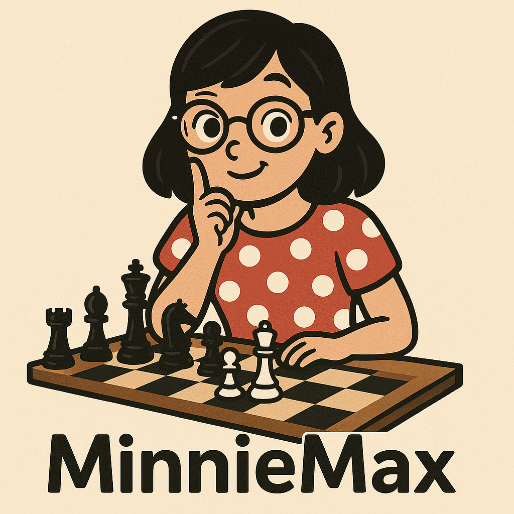

# MinnieMax

A minimalist minimax algorithm for JavaScript that works with any 2-player deterministic game.

## API

### `new MinnieMax(config)`

**Config object properties:**

- `applyMove(state, move)`:  
  Required. Returns a new state after applying the move.

- `generateMoves(state, player)`:  
  Required. Returns an array of all legal moves for the given player and state.

- `evaluate(state, player, depthRemaining)`:  
  Required. Returns a numeric score for the given state from the perspective of the specified player.

- `isGameOver(state)`:  
  Required. Returns `true` if the game is over in the given state.

- `depth`:  
  Required. Number of plies (half-moves) to simulate in the minimax search.

- `getPlayerFromState`:  
  Optional (`false` by default). If `true`, MinnieMax will read `state.player` from `applyMove()` to determine who moves next. If `false`, it assumes a strict 2-player turn alternation.

### `getDepth(): number`

Returns the current search depth.

### `setDepth(depth: number): number`

Sets the search depth (must be > 0) and stores it in `localStorage`. Returns the new depth.

### `getScoredMoves(state, player): Array<{ move, score }>`

Returns an array of all legal moves from the given state and player and each move's score.

## Example Projects

- [Boop Helper](https://github.com/bracketdash/boop)
- [Mancala Helper](https://github.com/bracketdash/mancala-helper)
- [Squadro Helper](https://github.com/bracketdash/squadro)
